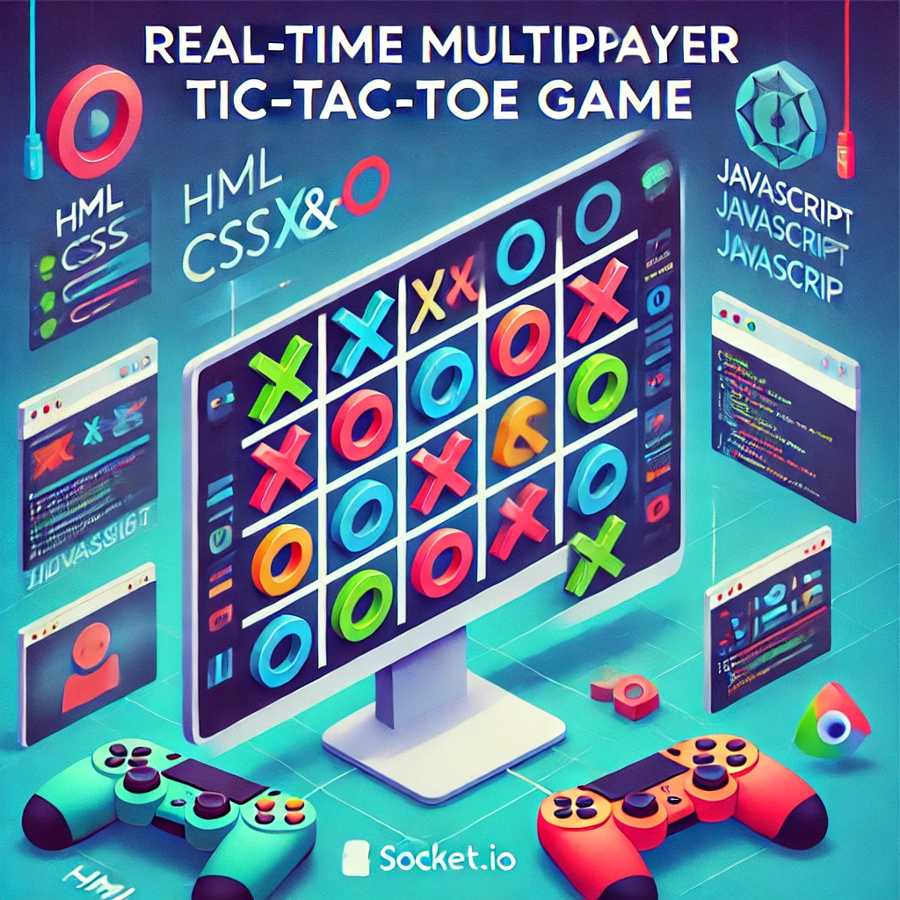
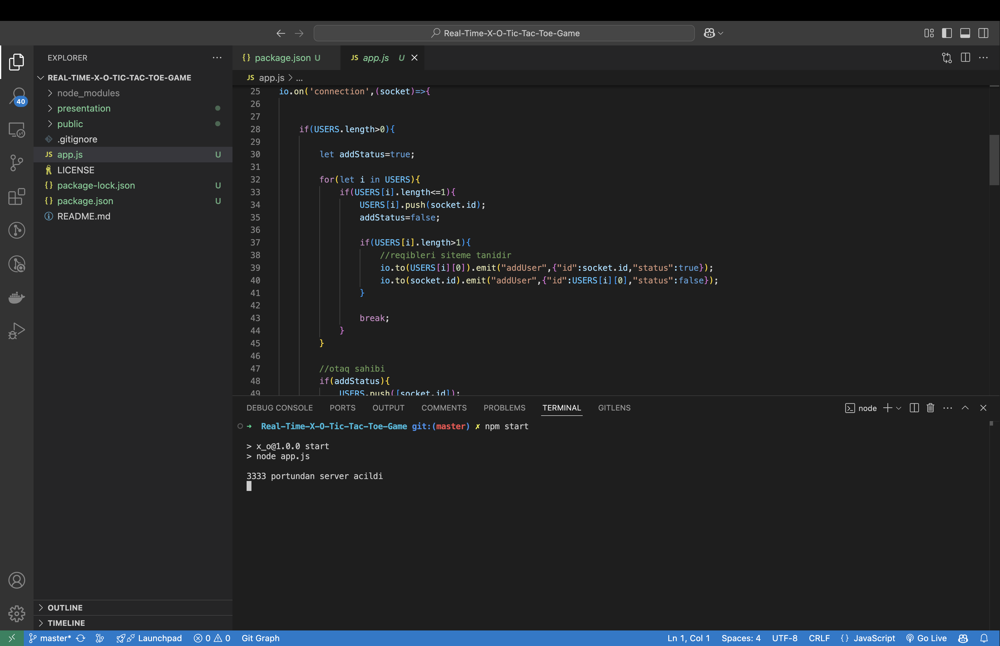
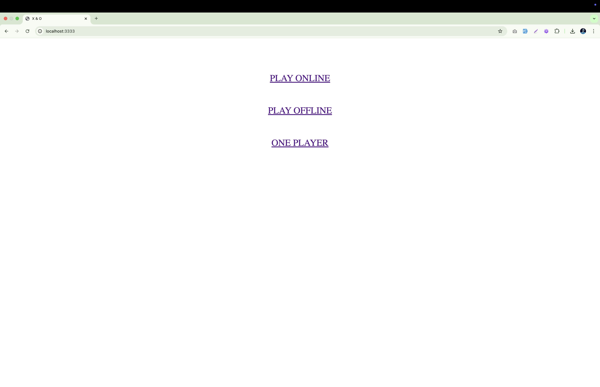
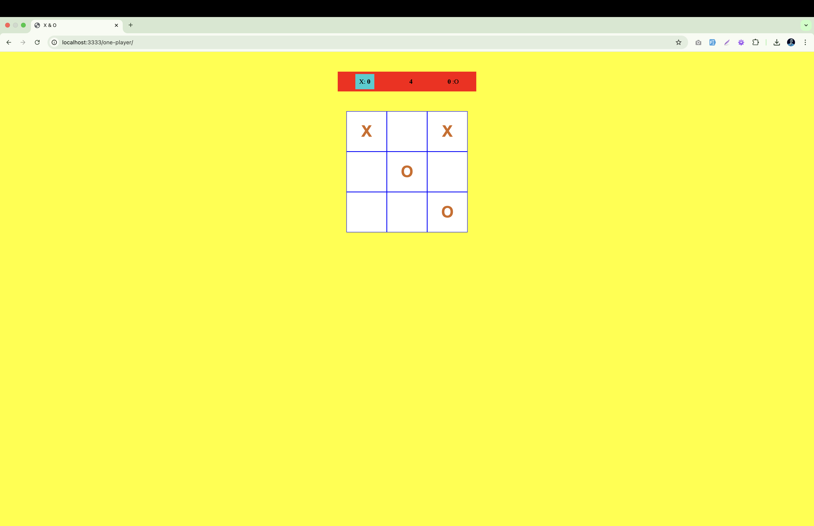
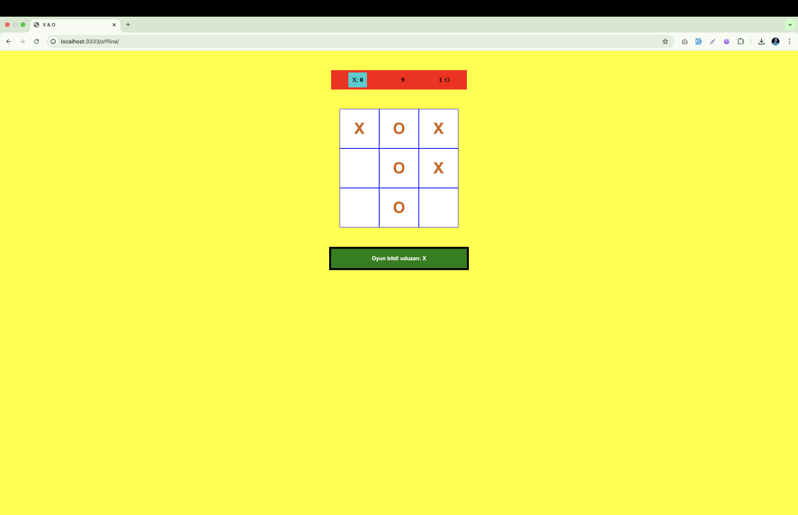
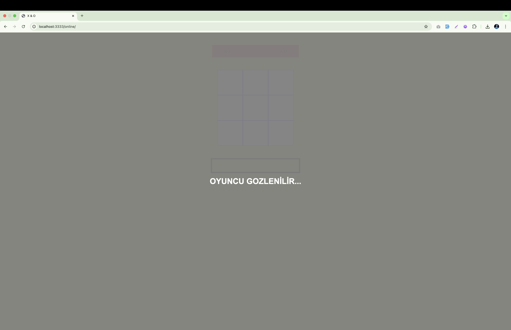
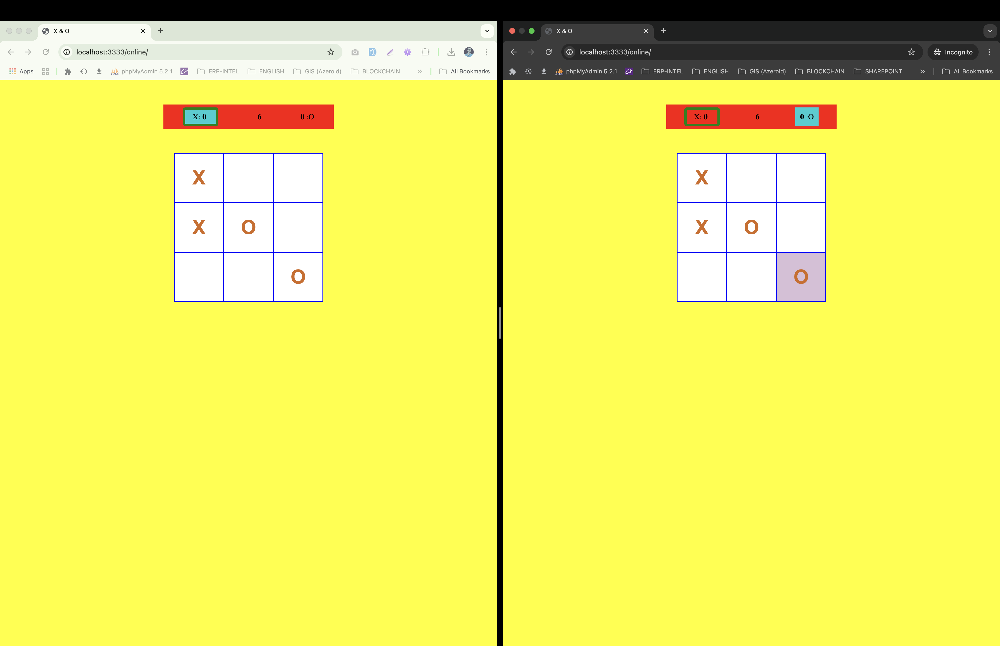

# 🎮 Real-Time Multiplayer X&O Oyunu

**Real-Time Multiplayer X&O** oyununa xoş gəldiniz! 🚀 Bu layihə **HTML, CSS, JavaScript və Socket.io** istifadə edərək hazırlanmış interaktiv və əyləncəli X&O oyunudur. Oyunçular müxtəlif rejimlərdə oyundan həzz ala bilərlər.

## 🌟 Oyun Rejimləri

✔️ **Süni İntellektə qarşı** – Kompüterə qarşı bacarıqlarınızı sınayın. <br/>
✔️ **Yerində Multiplayer** – Dostunuzla eyni cihazda oynayın. <br/>
✔️ **Online Multiplayer** – Dostlarınızla internet üzərindən real vaxt rejimində rəqabət aparın! <br/>

## 🛠️ İstifadə Edilən Texnologiyalar

- **JavaScript** – Oyunun məntiqi və istifadəçi interaksiyası üçün
- **Socket.io** – Real-time WebSocket bağlantısı ilə canlı oyun təcrübəsi
- **HTML & CSS** – Adaptiv və gözoxşayan dizayn

## ⚡ Xüsusiyyətlər

- 🎮 **Real vaxtda multiplayer** – Oyunu gecikməsiz oynayın!
- 🔗 **WebSocket texnologiyası** – Canlı əlaqə və sürətli cavab müddəti
- 📱 **Tam adaptiv dizayn** – Mobil və masaüstü cihazlarda problemsiz işləyir

## 🚀 Başlamaq Üçün

### Tələblər

Sisteminizdə **Node.js** quraşdırılmış olmalıdır.

### Quraşdırma

1. Repozitoriyanı klonlayın:

   ```bash
   git clone https://github.com/avazalijamal/Real-Time-X-O-Tic-Tac-Toe-Game.git
   cd Real-Time-X-O-Tic-Tac-Toe-Game
   ```

2. Lazımi paketləri quraşdırın:

   ```bash
   npm install
   ```

3. Serveri başladın:

   ```bash
   npm start
   ```

4. Oyunu brauzerdə açın:

   ```
   http://localhost:3333
   ```

## 📌 Canlı Demo

## 📷 Ekran Görüntüləri

Aşağıda oyunun bəzi ekran görüntülərini görmək olar:









## 📜 Lisenziya

Bu layihə **MIT Lisenziyası** altında təqdim olunur.

## 💬 Əlaqə və Rəylər

Layihəyə **töhfə verə, problem bildirə və ya fikirlərinizi bölüşə bilərsiniz!** 🙌

📩 Əlaqə: [[avazalijamal@gmail.com](mailto\:avazalijamal@gmail.com)]

---

⭐ **Əgər bu layihəni bəyəndinizsə, GitHub-da ulduz qoymağı unutmayın!** ⭐

